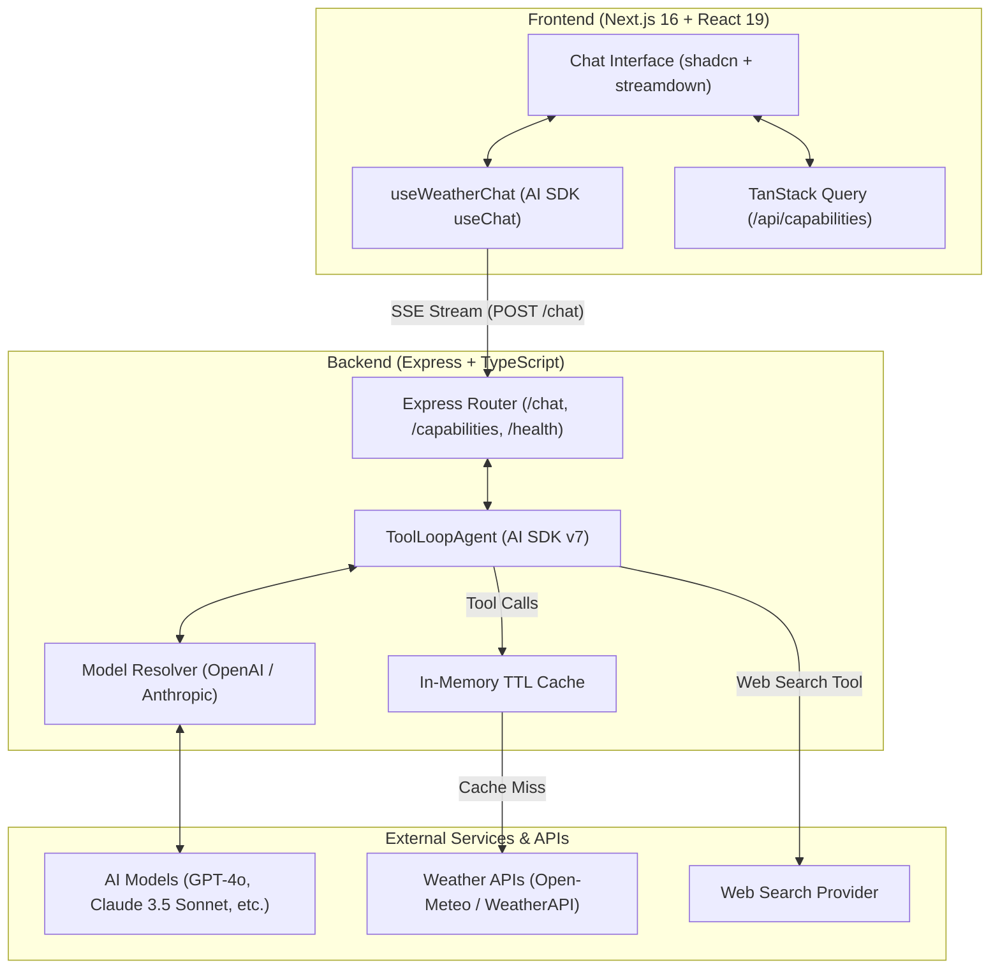

# Weather AI Agent 🌦️🤖

An agentic weather assistant powered by the Vercel AI SDK (`ToolLoopAgent`), featuring real-time Server-Sent Events (SSE) streaming, reasoning/thinking disclosures, dynamic model switching, multi-provider weather retrieval (Open-Meteo & WeatherAPI), and a Next.js 16 chat interface.

---

## 🏛️ System Architecture



---

## ✨ Features

- **Agentic Tool Loop:** Autonomous query resolution with step-budgeting, query caching, and geocoding via `ToolLoopAgent`.
- **Real-Time Streaming:** Low-latency SSE token streaming with live tool-invocation states and expandable model reasoning ("thinking") blocks.
- **Provider Resilience:** Supports multiple LLM providers (Anthropic & OpenAI) and weather data sources (Open-Meteo, WeatherAPI, and mock fallback).
- **In-Memory Caching:** Granular TTL cache for geocoding, current weather, multi-day forecasts, and severe weather alerts.
- **Modern Next.js 16 UI:** Responsive, accessible interface built with Tailwind CSS v4, Base UI / shadcn, Lucide icons, and Motion animations.
- **Zero Hardcoding:** Capabilities, selectable models, and suggestions are dynamically discovered from the server runtime via `/api/capabilities`.

---

## 🚀 Quick Start

### 1. Prerequisites
- **Node.js** >= 20.x
- **pnpm** >= 9.x
- API key for **OpenAI** (`OPENAI_API_KEY`) and/or **Anthropic** (`ANTHROPIC_API_KEY`)

### 2. Environment Configuration

Copy the example configuration file in the project root:

```bash
cp .env.example .env
```

Add your API keys to `.env` (or configure separate `.env` files in `server/` and `client/`):
```env
OPENAI_API_KEY=your_openai_key_here
ANTHROPIC_API_KEY=your_anthropic_key_here
```

### 3. Server Setup (Express API)

```bash
cd server
pnpm install
pnpm dev
```
*API runs on `http://localhost:8080` (endpoints: `POST /chat`, `GET /capabilities`, `GET /health/ready`).*

### 4. Client Setup (Next.js 16 App)

In a new terminal:

```bash
cd client
cp .env.example .env.local
pnpm install
pnpm dev
```
*Web app runs on `http://localhost:3000`.*

---

## 📂 Project Structure

```
.
├── client/                 # Next.js 16 (App Router) frontend
│   ├── app/                # App entrypoint, layout, globals.css (Tailwind v4)
│   ├── components/         # Chat panel, messages, widgets, shadcn UI components
│   └── lib/                # API client, contracts, useWeatherChat hook
├── server/                 # Express + TypeScript backend
│   ├── src/
│   │   ├── ai/             # ToolLoopAgent, model resolver, weather/search tools
│   │   ├── config/         # Zod environment schemas & model configs
│   │   ├── http/           # Routes (/chat, /capabilities), middleware, SSE streams
│   │   └── platform/       # In-memory cache, metrics, logger, error taxonomy
└── docs/                   # Architecture blueprints & implementation specs
```

---

## 🧪 Verification & Testing

Run automated tests and typechecks across both packages:

```bash
# Server tests & typecheck
cd server
pnpm test          # Runs Vitest test suite
pnpm typecheck     # TypeScript strict check

# Client typecheck & lint
cd ../client
npx tsc --noEmit   # Type safety validation
pnpm lint          # ESLint inspection
```

---

## 📄 License

This project is licensed under the Apache 2.0 License. See the [LICENSE](LICENSE) file for details.
